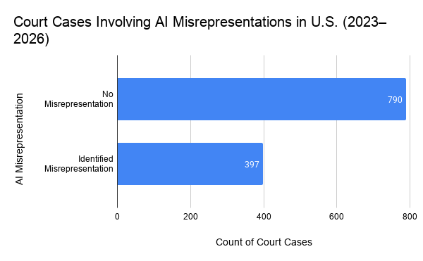
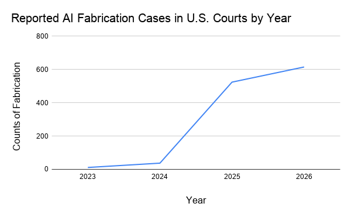
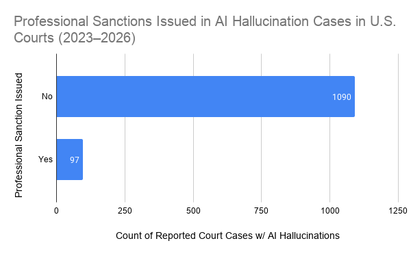

# journalism124
This is the Gracie Project, where she covers reported AI hallucination cases

# AI Hallucinations Have Reached the Courtroom

Imagine sitting in the pew of a courtroom, trusting that your lawyer, with their pedigree and skills, has developed a solid case in your defense. Suddenly, you hear the judge drill your lawyer, asking if the evidence your lawyer provided was AI-generated, since, upon reviewing the cited case law, the citations presented were not real. The air is heavy and dry. To everyone's shock, your lawyer admits they did use AI in the crafting of their argument.

Some version of this story is playing out in many American courts. International litigation and arbitration expert and data scientist Damien Charlotin created the [AI Hallucination Cases Database](https://www.damiencharlotin.com/hallucinations/?graphs=0&q=&sort_by=-date&states=USA&period_idx=0&legal_fields=) to track courts around the world flagging different AI hallucinations. Charlotin's methodology for finding this data is a multimodal process: he uses scrapers and bots, conducts searches across federal court electronic record databases such as PACER and CourtListener, and takes tips from people online as well as legal editors. Starting in mid-2025, Charlotin backdated the data collection to include cases from 2023 to the present, tracking more than 1,400 cases. All records in the database are either confirmed or implied AI hallucinations.

The quality of this data can be questioned because the database is non-exhaustive. Based on what is detailed on Charlotin's website, this endeavor is maintained by him and depends heavily on his ability to find or receive records online or through his network. Although the database is privately maintained rather than produced by a government agency or university, its process is transparent and relies on publicly available court records. Still, the process of identifying court cases causes a limitation in the number of AI hallucination cases that are ultimately included in the database.

## Data Analysis

I downloaded the CSV from Charlotin and imported it as a [Google Sheet](https://docs.google.com/spreadsheets/d/1Yv91CwpD8DY0Z-VZkD4V5o0dOkQIhK81TfExyuNs2BI/edit?usp=sharing). I noticed that the **Hallucination Items** column, which has three categories of different AI hallucination types, was not delineated into simple categories. Instead, each cell included text explaining the type of hallucination and the specific details about it.

To make the data easier to analyze, I created another column using the following formula to identify whether a case contained a false quote:

`=IF(REGEXMATCH(I2,"False Quotes"),"Identified False Quotes","No False Quotes")` formula

This was done for each row and repeated for the other two hallucination categories.

I also broke up the **Date** column, which was formatted as `YYYY-DD-MM`, into either years or months using the following formulas:

`=TEXT(D2,"yyyy")` formula

`=TEXT(D2,"mmm")` formula

This allowed me to perform my timeline and line graph analysis.

## Visualizations

Here is what each AI hallucination category in this dataset means: 
 - Fabrication: AI generates a fake case that presents itself as a real case
 - Misrepresentation: AI cites a real case with actual quotes, but the claim AI asserts about the case is wrong
 - False Quotes: AI generates fake quotes or holdings regarding a real case

This graph visualizes the count of court cases that were flagged for AI misrepresentation occurrence in the U.S. (2023–2026)

Source: Damien Charlotin, AI Hallucination Cases Database. Analysis by Gracie Osborne. 
Alt text: Bar chart showing the number of cases with reported AI misrepresentations. Out of the total 1187 cases where AI hallucinations were caught, 790 were identified with no misrepresentation, and 397 were identified with AI misrepresentation. 

This graph visualizes the trend of the number of AI hallucinations identified in the U.S. court cases between the years of 2023-2026 (all the way up to the end of June of 2026). 

Source: Damien Charlotin, AI Hallucination Cases Database. Analysis by Gracie Osborne. 
Alt text: Line graph showing the number of cases with reported AI hallucinations in each year. The line graph shows an increasing trend of AI hallucinations reported in court cases. 

This graph visualizes the number of professional sanctions issued in AI hallucination cases in U.S. Courts (2023–2026). 

Source: Damien Charlotin, AI Hallucination Cases Database. Analysis by Gracie Osborne. 
Alt text: Bar chart comparing the number of reported AI hallucination cases that resulted in professional sanctions versus those that did not. 1090 reported cases did not result in a professional sanction out of the 1187 cases in the database.

## Ethical Considerations

Like said above, the limitations in the scope of this project lead to an incomplete picture. There are many cases of AI hallucinations reported in this database that occurred in U.S. courts, and while Charlotin points out that the U.S. court system has more transparency than other countries and a faster adoption of AI, it could also be that the data collection process is not comprehensive. A surface-level scan of the database may make one assume the U.S. inherently has more AI hallucination cases, when differences in transparency and reporting practices may partially explain that pattern. This could unintentionally create a skewed perception of U.S. judges, attorneys, and other legal professionals.

Additionally, many tools used to identify AI hallucinations were not developed during the initial rise of large language models in 2022 and 2023. As each year goes on, there is a greater awareness of the need to cross-check AI-generated information. This is important to note because there is also a chance that the lower number of reported cases from 2023 and 2024 does not necessarily mean there were fewer AI hallucinations, but rather that many hallucinations, especially misrepresentations, went under the radar. So maybe the surge we are seeing right now is not necessarily an actual surge in AI hallucinations. To make this a more complete story, I would compare the data with another publicly available court record database. Overall, this story is important as AI is rapidly being included in many professions' workflows, including in law. AI hallucinations put the integrity of one's case in jeopardy. Legal professionals must cross-check all information to ensure evidence is accurate. 
